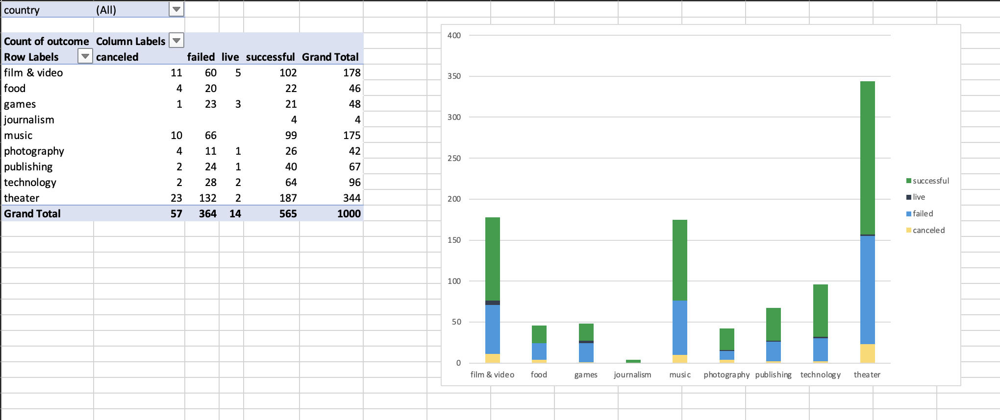

# excel-challenge
Crowdfunding Data Analysis with Microsoft Excel

## Contents
1. [Overview](#1-overview)
2. [Repository](#2-repository)
3. [Deployment](#3-deployment)
4. [Data Analysis](#4-data-analysis)
5. [References](#5-references)

## 1. Overview

This repository contains an Excel file that features a series of analyses performed on crowdfunding campaign data. The data, obtained from a dataset of 1,000 sample projects, has been processed to uncover insights into market trends, campaign outcomes, and other related metrics. The aim of this challenge is to analyse various factors that determine the success or failure of crowdfunding campaigns.

Conditional formatting was applied to the `Outcome` and `Percent Funded` columns to visually highlight the campaign results and funding progress. Additionally, formulas such as `COUNTIFS()`, `AVERAGE()`, and `STDEV()` were used to calculate key metrics, including success rates and average donations. Pivot tables and charts were then created to summarise and visualise trends in the data, such as the number of successful campaigns across different categories and the relationship between campaign goals and outcomes. These methods collectively helped uncover patterns and provided valuable insights into the crowdfunding data.

## 2. Repository

The repository includes the following files:
- `CrowdfundingBook.xlsx`: This file contains the dataset of 1,000 sample crowdfunding campaigns. The data has been modified with added columns for analysis.
- [`REPORT.md`](REPORT.md): This file contains the analysis report, detailing conclusions drawn from the dataset and visualisations.
- [`images/`](images): This folder contains screenshots that are featured in [`REPORT.md`](REPORT.md).

## 3. Deployment

To work with the data analysis:
1. Clone this repository to your local machine.
2. Open `CrowdfundingBook.xlsx` using Microsoft Excel.
3. View and interact with the analysis created in the workbook, including pivot tables, charts, and various new columns.
4. Check the [`REPORT.md`](REPORT.md) file for a detailed analysis of the findings.

## 4. Data Analysis

The analysis was based on the dataset of 1,000 crowdfunding campaigns. Various Excel tools were utilised to explore trends and uncover insights. Here are the steps taken:
1. Outcome and Funding Visualisation: Conditional formatting was applied to the Outcome and Percent Funded columns. This highlighted the status of campaigns (successful, failed, cancelled, or live) and visually represented the funding progress using a colour scale. This helped in quickly assessing the campaigns’ performance.
2. Metrics Calculations: Several Excel functions were used to calculate key metrics:
   - `COUNTIFS()` was used to calculate the number of successful, failed, or cancelled campaigns in different goal ranges.
   - `AVERAGE()` helped in calculating the average donation per campaign.
   - `STDEV()` was applied to determine the variability in the number of backers for successful versus unsuccessful campaigns.
3. Pivot Tables and Charts: Pivot tables were created to summarise the data by category and sub-category, showing the number of successful, failed, cancelled, or live campaigns. Stacked-column charts were then used to visualise the distribution of outcomes, making it easier to identify patterns in different categories or regions.
4. Trend Analysis: The relationship between the crowdfunding goal and success rates was explored, with line graphs illustrating how goal amounts correlated with the likelihood of success, failure, or cancellation.

Through these methods, key insights into crowdfunding success were uncovered, such as how certain categories performed better than others and how campaign goals affected the likelihood of success.

Further analysis can be found in the [`REPORT.md`](REPORT.md) file.

## 5. References

Data for this dataset was generated by edX Boot Camps LLC, and is intended for educational purposes only.
