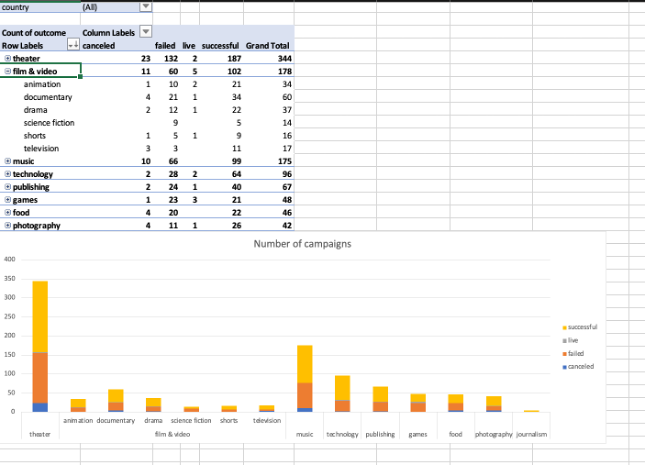
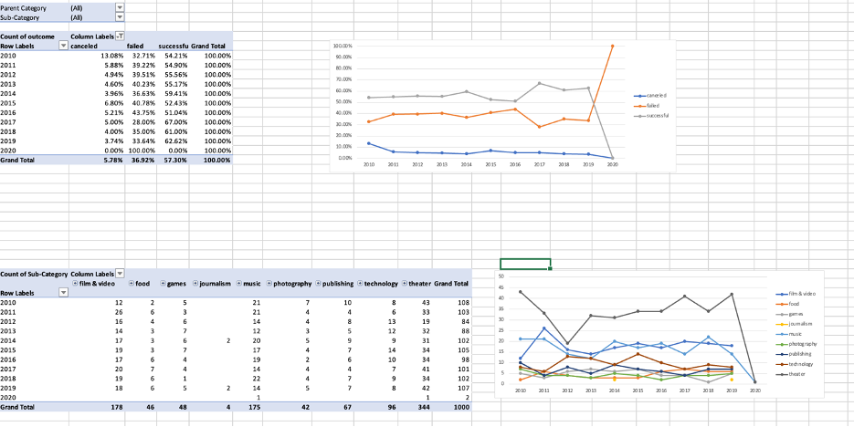

# Crowdfunding Report

## Given the provided data, what are three conclusions that can be drawn about crowdfunding campaigns?

1. According to the number of crowdfunding campaigns in each (parent) category, the most popular category for crowdfunding is theatre, with 344 out of 1000 of the total number. The next two most popular categories for crowdfunding campaigns are film & video (178/1000) and music (175/1000). The figure for other campaigns in other categories ranges from 40 to 100. Journalism is the category with the least number of crowdfunding campaigns.

2. The overall success rate for crowdfunding campaigns is 57.3%. Other than journalism, the success rates for campaigns in most categories range from 45% to 69%. The reasons why campaigns in some categories are easier to succeed in than others can be derived. Journalism campaigns have a 100% success rate, but since the base number is so small (4 out of 1000), no conclusion should be drawn as to whether they are easy to succeed in.

3. From the overall figure, no direct correlation between the success rate of a crowdfunding campaign and the month it started can be found. However, a pattern may potentially be found if each category is examined closely. Factors like seasons, public holidays, and countries may affect the success rate of different campaigns.

## What are some limitations of this dataset?

The limitation of this dataset is that it only contains raw data, which has no inherent meaning. If handled and presented incorrectly, misleading conclusions can be drawn. For example, campaigns for journalism have a high success rate of 100%. If not careful enough, it could be concluded that it is easy for such campaigns to be successful.

Another limitation is that although some trends may be found in the data, the reasons behind such trends cannot be explained. It may be speculated that seasons and public holidays affect the success rate of certain kinds of campaigns, but these speculations cannot be proven true unless further data is gathered.

## What are some other possible tables and/or graphs that could be created, and what additional value would they provide?

Improving the presentation of data is essential. For example, the information was displayed in a nested table to clearly show both the data for parent categories and sub-categories.

Two graphs were also created to show the relationships between the **year** and (a) the **number of campaigns** as well as (b) the **success rate** of the campaigns. This helps to show the trend of whether (a) crowdfunding campaigns have gained/lost **popularity** and (b) whether the **rate of success** has changed over the years. The **“total backer count”** and **“success rate”** of campaigns were presented in two separate graphs to show that both sets of data are important in their own right. Presenting data according to the **year** may give a different insight compared to presenting it according to the month of the year.

## Use the data to determine whether the mean or the median better summarises the data.

Based on the data, there are overwhelmingly high numbers of campaigns that attract 0-500 backers, regardless of whether they are successful or unsuccessful.

| | Successful Campaigns | Unsuccessful Campaigns |
| --- | --- | --- |
| mean number of backers | 851 | 586 |
| median number of backers | 201 | 114.5 |
| minimum number of backers | 16 | 0 |
| maximum number of backers | 7295 | 6080 |
| variance of the number of backers | 1606216.59 | 924113.45 |
| standard deviation of the number of backers | 1267.37 | 961.31 |
| **standard deviation / mean ratio** | **1.49** | **1.64** |
| **standard deviation / median ratio** | **6.31** | **8.40** |

The **mean** number of backers for **successful campaigns** and **unsuccessful campaigns** are **851** and **586** respectively. The figures are much **higher than the median**. The mean is heavily affected by outliers.  
The **standard deviation** for **successful campaigns** and **unsuccessful campaigns** are **1267** and **961** respectively. These are **1.49 times** and **1.64 times the mean**. This suggests a **heavy-tailed distribution**.  
In this case, the **median** better summarises the data because it reflects the situation of the majority of the campaigns and is less significantly impacted by the outliers than the mean.

## Use the data to determine if there is more variability with successful or unsuccessful campaigns. Does this make sense? Why or why not?

The number of backers for successful campaigns is higher than for unsuccessful campaigns. It is a common understanding that with more backers, campaigns are more likely to succeed.

Based on the data, the **standard deviation to mean ratio** and **standard deviation to median ratio** are both **higher** for **unsuccessful campaigns**. There is **more variability** with unsuccessful campaigns than with successful campaigns.  
This makes sense because while support from backers may be an advantage, there can be **miscellaneous factors** that cause a campaign to fail. For example, legal issues or the failure to implement ideas into practice. Many of these factors have little or **no correlation with the funding goals**, and the **number of backers** a campaign has. Therefore, it makes sense that there is more variability in data for unsuccessful campaigns.
